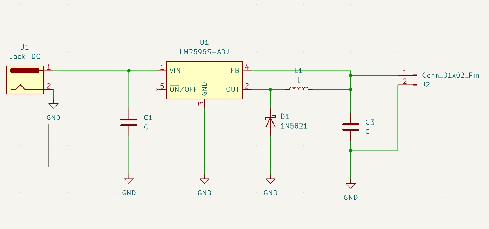
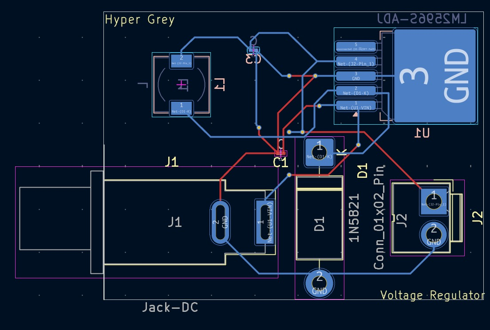
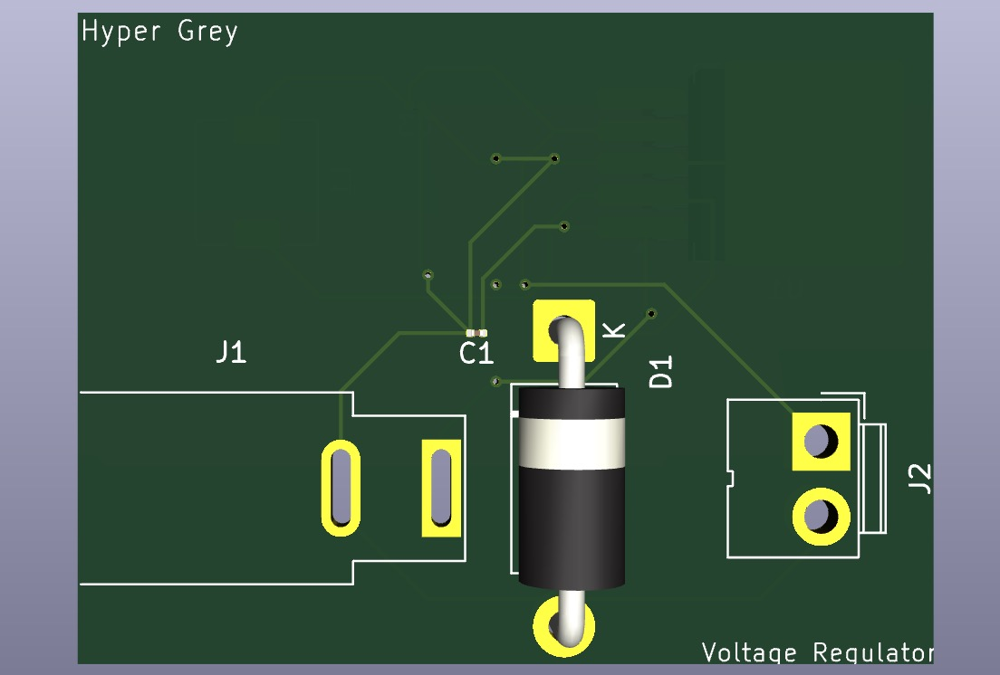

# LM2596 Switching Regulator PCB ⚡

A learning-oriented PCB design of an LM2596 adjustable buck converter created while exploring switching regulator topology and KiCad PCB workflows.

---

##  Preview

### Schematic

### PCB Layout

### 3D View (Front)

### 3D View (Back)

---

##  Features

- LM2596S-ADJ switching regulator topology
- Schottky diode based rectification (1N5821)
- Inductor-based energy storage
- Designed and routed using KiCad
- Ground-plane based layout approach

---

##  Project Structure

hardware/
├── x.kicad_sch
├── x.kicad_pcb
└── x.kicad_pro

Images/
├── pcb.png
├── pcb_3d_fv.png
└── pcb_3d_bv.png

---

##  Learning Goals

This project focuses on:

- Understanding buck converter architecture
- Switching power supply layout considerations
- High-current routing basics
- KiCad schematic and PCB workflow

---

## 🛠️ Tools Used

- KiCad (Schematic + PCB Layout)
- 3D Viewer for visualization

---

##  Future Improvements

- Add feedback resistor network calculations
- Optimize switching loop placement
- Improve power trace width analysis
